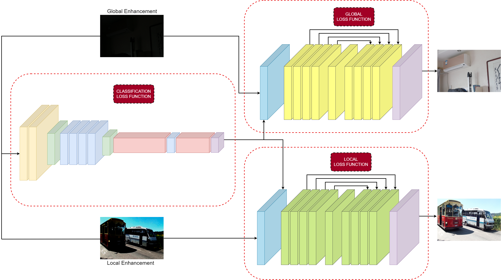

# LoLi-IEA: low-light image enhancement algorithm

## Overview

This repository contains the source code and associated materials for the paper titled **LoLi-IEA: low-light image enhancement algorithm**. The aim of this research is the visual enhancement of low-light images.



## Requirements

## Test

## Citation
If this work contributes to your research, we would appreciate it if you could cite our paper:

```bibtex
@inproceedings{perez2023loli,
  title={LoLi-IEA: low-light image enhancement algorithm},
  author={Perez-Zarate, Ezequiel and Ramos-Soto, Oscar and Rodr{\'\i}guez-Esparza, Erick and Aguilar, German},
  booktitle={Applications of Machine Learning 2023},
  volume={12675},
  pages={230--245},
  year={2023},
  organization={SPIE}
}
